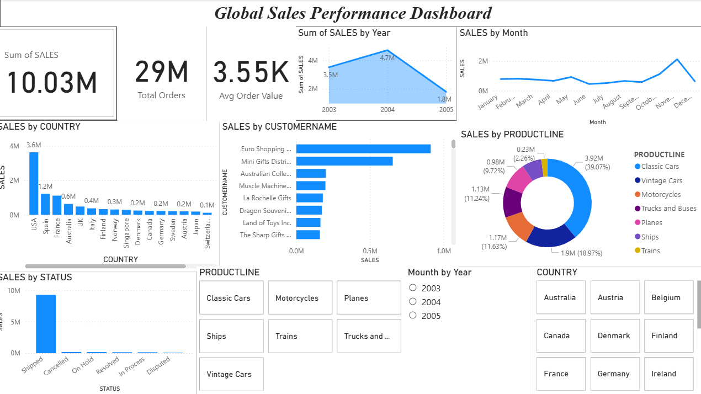
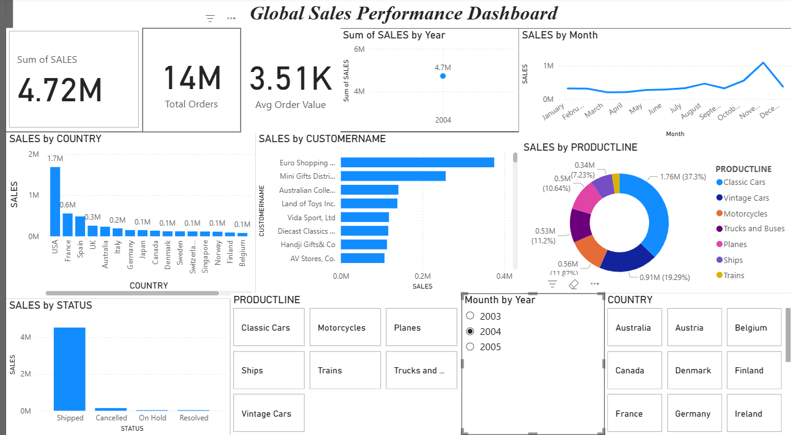

# Global Sales Performance Dashboard

## Project Overview
This project analyzes global retail sales data using Python and Power BI to generate business insights on sales trends, customer contribution, country performance, and product line distribution.

The project combines:
- Python data analysis using Pandas and Matplotlib
- Interactive dashboard creation using Power BI
- Business insight reporting using sales KPIs

---

## Tools & Technologies Used

### Python
- Pandas
- Matplotlib

### Business Intelligence
- Microsoft Power BI

### Dataset
- Global retail sales dataset (sales_data_sample.csv)

---

## Project Components

### 1. Python Data Analysis
Performed:
- Yearly sales trend analysis
- Monthly sales trend analysis
- Country-wise sales analysis
- Top 10 customers by revenue
- Product line performance analysis
- Sales status analysis

### 2. Power BI Dashboard
Built interactive dashboard containing:
- Total Sales KPI
- Total Orders KPI
- Average Order Value KPI
- Yearly Sales Trend Chart
- Monthly Sales Trend Chart
- Country Sales Comparison
- Top Customer Contribution Chart
- Product Line Distribution Donut Chart
- Sales by Status Analysis
- Dynamic slicers for Country, Year, Product Line

---

## Key Insights

- Total Sales exceeded 10 million across all years.
- 2004 recorded the highest annual sales.
- USA generated the highest country sales.
- Euro Shopping Channel is the top revenue-generating customer.
- Classic Cars is the best-performing product line.
- Most orders fall under Shipped status.

---

## Folder Structure

global-sales-dashboard/
│
│──sales_data_sample.csv
│
├──sales_analysis.py
│
├── Global_Sales_Dashboard.pbix
│
├── images/
│ ├── dashboard_screenshot.png
│ ├── yearly_sales_chart.png
│ └── top_customers_chart.png
│
├── README.md
└── requirements.txt

---

## Dashboard Preview

---

## How to Run Python Analysis

1. Install dependencies:
pip install pandas matplotlib

2. Run analysis:
python sales_analysis.py

---

## Future Improvements

- Add profit margin analysis
- Add regional sales map visualization
- Deploy dashboard online
- Integrate SQL database backend

---

## Author

Mashetty Sai Prashanth

Aspiring Data Analyst | Python Developer | Power BI Enthusiast
